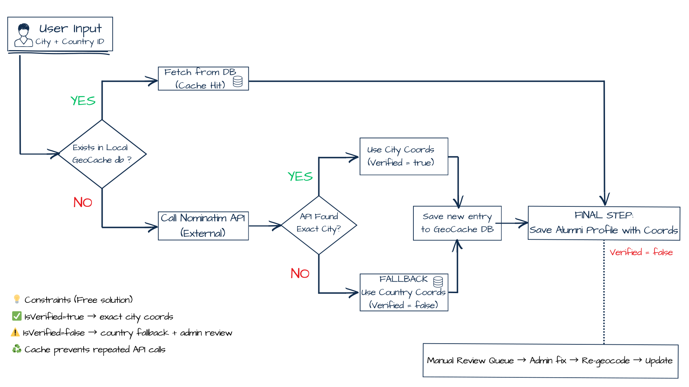

# 🎓 Medical Faculty Alumni Platform

A centralized digital platform connecting students and graduates of the Medical Faculty.

This project is currently under active development as a modern solution for the Alumni community, aimed at enabling former students to stay connected, track scientific events, and share professional opportunities.

---

## 📖 About the Project

The Alumni Platform transforms how the Medical Faculty interacts with its graduates.  
Replacing outdated lists and manual workflows, the application provides a modern, interactive experience where users can:

- ✅ Create professional profiles and become **verified members** of the organization  
- 🌍 Visualize global Alumni presence via an **interactive world map**  
- 🗓️ Register online for **congresses and educational events**  
- 💼 Access an exclusive **job board** and read inspiring **Alumni Stories**  
- 💳 View financial reports and subscription statuses (Administrative Dashboard). **financial module**  
- ⚙️ Benefit from automation (**geolocation, verification**) and scalability (**data caching**)  

---

## 🛠 Tech Stack

### Backend
- **.NET 8 (ASP.NET Core Web API)** - service-oriented architecture  
- **Entity Framework Core** - Code-First approach  
- **SQL Server** - relational database  
- **Dependency Injection** + **Repository Pattern**

### Frontend
- **React** - SPA (Single Page Application)  
- **Leaflet / React-Leaflet** - map rendering

### Integrations
- **Nominatim (OpenStreetMap)** - location geocoding  

---

## 🚀 Key Challenges & Solutions

### 1. Intelligent Geocoding & Fallback-First Caching

One of the primary engineering goals was to map users worldwide accurately without overloading external APIs, while still handling typos and imperfect data entry gracefully.

#### Geocoding Workflow Diagram

### 💻 Implementation shortcuts

- 🧠 **Geocoding Core Logic**
  [`GeocodingService.ResolveLocationAsync`](backend/src/AlumniApi/Services/Geocoding/Geocoding.cs)
  *The heart of the system: handles local cache checks, API requests, and fallback saving.*

- 🧩 **Cache Key Generator**
  [`StringHelper.GenerateSearchKey`](backend/src/AlumniApi/Helpers/StringHelper.cs)
  *Normalizes city and country names to ensure cache hits.*

- 🧭 **API Controllers**
  [`MembershipController.SubmitApplication`](backend/src/AlumniApi/Controllers/MembershipController.cs) & [`GetMap`](backend/src/AlumniApi/Controllers/MembershipController.cs)
  *Endpoints for processing applications and serving map data.*

- ⚙️ **Service Configuration**
  [`Program.cs`](backend/src/AlumniApi/Program.cs)
  *Dependency Injection and HttpClient setup.*

➡️ Details: [`docs/geocoding.md`](docs/geocoding.md)

